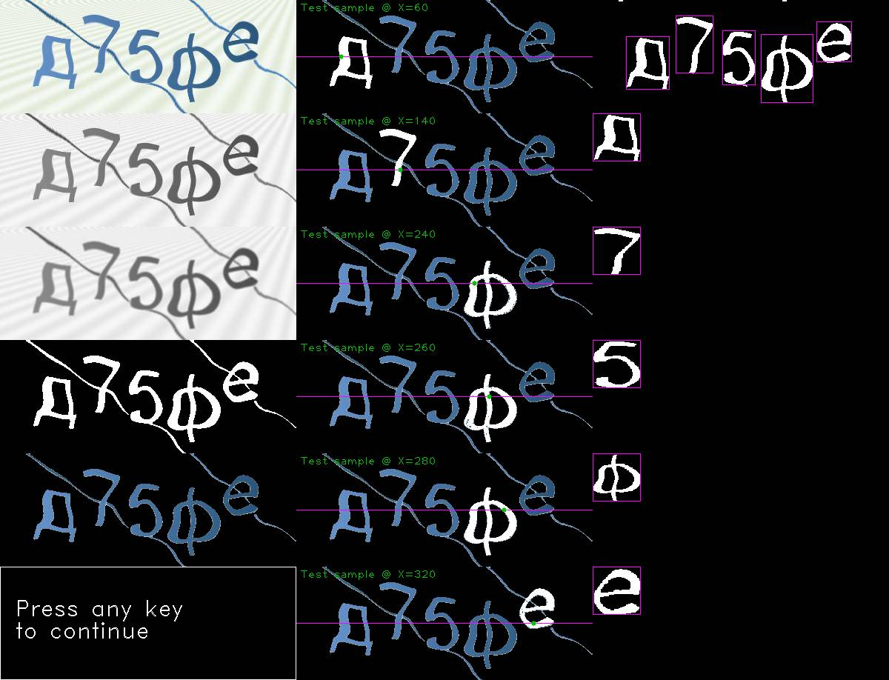

# 🟦 vk-new-captcha-solver

## New (russian) VK captcha solver with built-in server

> Tested September 2024

## Решатель новых капч ВК (с русскими символами) со встроенным сервером

> Проверено в сентябре 2024

----------

## ⚠️ Disclaimer

This repository is provided for **educational purposes only**. The author(s) of this repository do not endorse or support the use of this software for any illegal or unethical activities.

**By using this repository, you acknowledge that:**

- The software is provided "AS IS", without any guarantees or warranties. There is no assurance that the software will work as intended in all situations, nor that it will be suitable for your particular needs.
- The author(s) are not responsible for any misuse, damages, or legal issues that may arise from the use of this software. This includes, but is not limited to, any damage to systems, data loss, or legal consequences resulting from the use of this code.
- Any consequences, whether intended or unintended, of using this software, are solely your responsibility. You agree to use the software at your own risk.
- The software is intended for learning and research purposes. Any other use, especially in ways that violate the terms of service of websites or applicable laws, is strongly discouraged.

----------

## ⚠️ Отказ от ответственности

Этот репозиторий предоставлен **исключительно в образовательных целях**. Автор(ы) данного репозитория не одобряют и не поддерживают использование данного программного обеспечения для каких-либо незаконных или неэтичных действий.

**Используя этот репозиторий, вы подтверждаете, что:**

- Программное обеспечение предоставляется "КАК ЕСТЬ", без каких-либо гарантий или заверений. Нет никаких гарантий, что программа будет работать, как задумано, во всех случаях, или что она подходит для ваших конкретных нужд.
- Автор(ы) не несут ответственности за какое-либо неправильное использование, ущерб или правовые последствия, которые могут возникнуть в результате использования этого программного обеспечения. Это включает, но не ограничивается, повреждением систем, потерей данных или юридическими последствиями, возникающими в результате использования этого кода.
- Любые последствия, будь то преднамеренные или непреднамеренные, от использования этого программного обеспечения, являются исключительно вашей ответственностью. Вы соглашаетесь использовать это программное обеспечение на свой страх и риск.
- Программное обеспечение предназначено для обучения и исследований. Любое другое использование, особенно способы, нарушающие условия обслуживания веб-сайтов или действующее законодательство, строго не рекомендуется.

----------

## ✨ Features / Особенности

- A distinctive feature is segmentation using OpenCV before character recognition.
- Отличительной особенностью является наличие сегментации при помощи компьютерного зрения перед распознаванием нейронной сетью.

> debug image of segmentation process using -d/--debug argument


----------

## ❓ Usage / Использование

### 🏗️ From source / Из исходников

```shell
git clone https://github.com/F33RNI/vk-new-captcha-solver.git && cd vk-new-captcha-solver
python -m venv venv

# For Linux
source venv/bin/activate

# For windows
venv\Scripts\activate.bat

pip install -r requirements.txt

python main.py --help
python main.py -l -i
```

### 📦 From releases / Из релизов

- Download latest version from <https://github.com/F33RNI/vk-new-captcha-solver/releases/latest>
- Download `model` directory from this repo
- Run using

    ```shell
    vk-new-captcha-solver-* --help
    vk-new-captcha-solver-* -l "path/to/model" -i
    ```

> The server accepts requests for **base64** images in text/plain format. Just send captcha as **base64** using POST request
> to the running server and get a response in text/plain format.
>
> Сервер принимает запросы **base64** изображения капчи в формате text/plain. Просто отправьте **base64** капчу в виде
> POST-запроса на запущенный сервер и получите ответ также в формате text/plain.
>
> ⚠️ Do not use the image from the src attribute of the `` tag, as it will be **different** from the displayed captcha. To get the actual image, use the script below
>
> ⚠️ Не используйте изображение из атрибута src тэга ``, т.к. оно **будет отличаться** от отображаемой капчи. Для того, чтобы получить актуальное изображение, используйте скрипт ниже

```javascript
const captchaImg = document.querySelector(".box_layout").querySelector("img");

const canvas = document.createElement("canvas");
canvas.width = captchaImg.naturalWidth;
canvas.height = captchaImg.naturalHeight;

canvas.getContext("2d").drawImage(captchaImg, 0, 0);

const captchaBase64 = canvas.toDataURL("image/png");

// Now you can send captchaBase64 to the server to solve it
```

> ⚠️ You can find implementation example in `removeLikes.js`. The script is designed to remove **all** likes under posts / comments.
>
> ⚠️ Пример реализации в файле `removeLikes.js`. Скрипт предназначен для удаления **всех** лайков под постами / комментариями.

```text
usage: vk-new-captcha-solver [-h] (-t [DATASET_FILES_PATTERN] | -l [MODEL_DIR]) [-s [MODEL_DIR]] [-f IMAGE_FILE_PATH]
                             [-i [SERVER_IP_PORT]] [-o RESULTS_DIR] [-p KEY=VALUE [KEY=VALUE ...]] [-d] [-v]

New (russian) VK captcha solver with built-in server

options:
  -h, --help            show this help message and exit
  -t [DATASET_FILES_PATTERN], --train [DATASET_FILES_PATTERN]
                        train model with provided files (Default: dataset/*.png). Each file must have captcha's value name
                        (Example: жхфш.png)
  -l [MODEL_DIR], --load [MODEL_DIR]
                        load model and labels map from directory (Default: model)
  -s [MODEL_DIR], --save [MODEL_DIR]
                        save model and labels map (after training or loading it) into directory (Default: model)
  -f IMAGE_FILE_PATH, --from-file IMAGE_FILE_PATH
                        solve captcha from image file (Example: --from-file="captcha.png")
  -i [SERVER_IP_PORT], --server [SERVER_IP_PORT]
                        start server on IP:Port (Default: model) (Example: --server="0.0.0.0:8090") Send POST request with image
                        as base64 (text/plain) to solve it. Response will also be in text/plain format
  -o RESULTS_DIR, --save-results RESULTS_DIR
                        save solved captchas as images with result as name into directory
  -p KEY=VALUE [KEY=VALUE ...], --params KEY=VALUE [KEY=VALUE ...]
                        parameters for segmentation and training as key=value pairs (Ex.: -e training_epochs=50) NOTE: All
                        values are always treated as integers Available keys: training_epochs (Default: 20),
                        no_background_mask_blur_kernel_x (Default: 3), no_background_mask_blur_kernel_y (Default: 3),
                        no_background_mask_threshold (Default: 180), no_background_mask_erode_kernel_x (Default: 3),
                        no_background_mask_erode_kernel_y (Default: 2), floodfill_threshold (Default: 39), group_threshold
                        (Default: 2), min_character_width (Default: 34), max_character_width (Default: 110),
                        min_character_height (Default: 34), max_character_height (Default: 110), min_pixel_density (Default:
                        12), rects_group_threshold (Default: 2), rects_group_eps (Default: 45)
  -d, --debug           show debug images of segmentation
  -v, --version         show program's version number and exit

examples:
  vk-new-captcha-solver --train "./dataset/*.png" --save "./model"
  vk-new-captcha-solver --load "./model" --save-results "./solved" --from-file "/path/to/test.png"
  vk-new-captcha-solver --load "./model" --save-results "./solved" --server "localhost:5000"
  or simply:
  vk-new-captcha-solver -l -o "./solved" -i "localhost:5000"
  vk-new-captcha-solver -l -i

```
